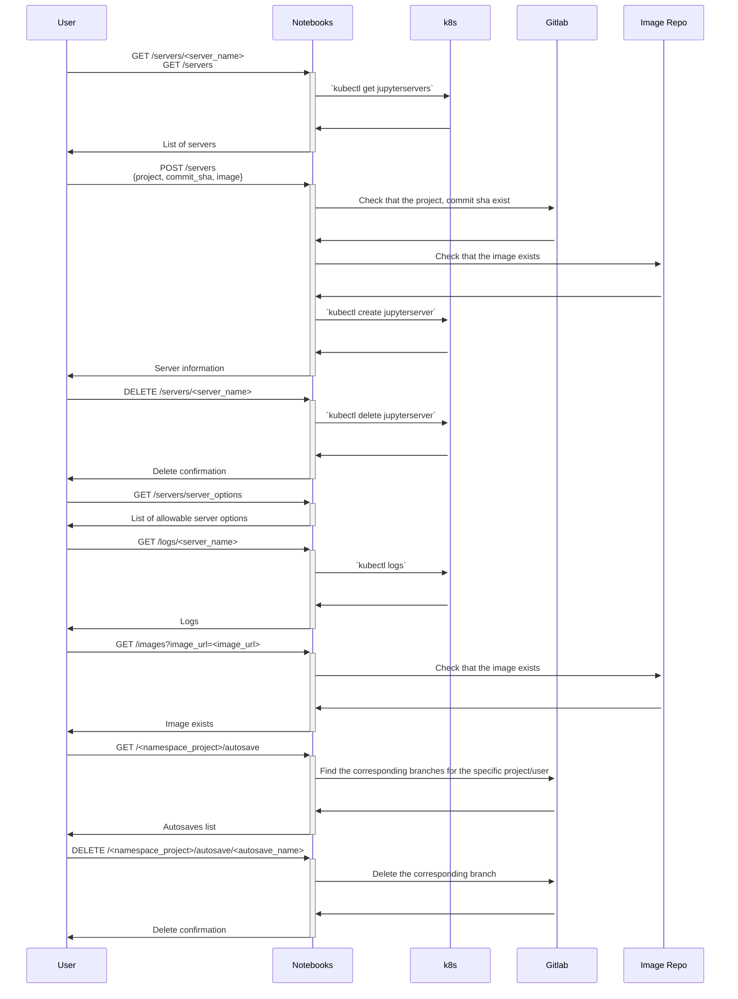

# Renku notebooks

[![CI]][1]
[![Conventional Commits]][2]

A simple service using the [Amalthea operator] to provide interactive
Jupyter notebooks for the Renku platform.

The service relies on [renku-gateway] for authentication. However,
anonymous users are supported as well in which case anyone can start and
use sessions for public renku projects. Therefore, the notebook service
can run even without having the renku-gateway installed or present. In
this case only sessions for anonymous users can be launched.

## Endpoints

The service defines endpoints to list the active sessions for a user,
start or stop a session. It can also provide the logs of a running user
session or information about work that was saved automatically if a user
stops a session without committing and pushing all their work to their
project repository.

The endpoints for the API will be defined in the swagger page of any
Renku deployment. The swagger page is usually available at
`https://<domain-name>/swagger/?urls.primaryName=notebooks%20service`.

[Here][swagger] you can look at the swagger page for the [renkulab.io][renkulab] deployment
and explore the endpoints in more detail.

## Sequence diagram

Please note that the Notebook service does not execute `kubectl` commands from
the shell against a kubernetes cluster. It uses the [k8s client for Python][k8s python client].
Simple shell `kubectl` commands are shown below for clarity. The notebook service
uses the Python k8s client to execute the equivalent queries directly from Python
without using the shell.

Please refer to the [swagger][swagger] page on the [renkulab.io][renkulab] deployment for additional information
on the format of the requests and responses from the API.

## Usage

The best way to use `renku-notebooks` is as a part of a `renku` platform
deployment. As described above using `renku-notebooks` without the other
components in the `renku` platform will only allow the usage of
anonymous sessions for public renku projects. This is a drawback because
anonymous sessions do not allow users to save their work but rather to
quickly test something out or explore what renku has to offer.

If used as a part of `renku` the notebook service receives all required
user credentials from `renku-gateway`, another service in the `renku`
platform. These credentials include information about the user and their
git credentials. The notebook service then uses the git credentials to
clone the user's repository, pull images from the registry if needed and
sets up a proxy that handles and authenticates all git commands issued
by the user in the session without asking the user to log in GitLab
every time they launch a session.

## Building images and charts

To build the images and render the chart locally, use [chartpress]. Install it
with `pip` or use `poetry install`.

## Development flow

You can run the notebook service locally in a few easy steps:
- install poetry
- run `poetry install`
- create a copy of `example.config.hocon` in the root of the repository called `.config.hocon` and fill in the required values
- if using VS code simply use the `Flask` configuration from `.vscode/launch.json`
- if not using VS code execute `FLASK_APP=renku_notebooks/wsgi.py FLASK_ENV=development CONFIG_FILE=.config.hocon poetry run flask run --no-debugger -h localhost -p 8000`

In addition to the above steps if you have a running Renku deployment you can use [telepresence]
(https://www.telepresence.io/docs/latest/install/) to route traffic from a deployment to your development 
environment. After you have set up telepresence you can simply run the `run-telepresence.sh` script.
This script will try to find a Renku Helm deployment in your current K8s context and active namespace.
Then it will redirect all traffic for the notebooks service from the deployment to your local machine at
port `8000`. Combining telepresence with the steps above can be used to quickly test a notebook
service in a full Renku deployment.

  [CI]: https://github.com/SwissDataScienceCenter/renku-notebooks/workflows/CI/badge.svg
  [1]: https://github.com/SwissDataScienceCenter/renku-notebooks/actions?query=branch%3Amaster+workflow%3ACI
  [Conventional Commits]: https://img.shields.io/badge/Conventional%20Commits-1.0.0-yellow.svg?style=flat-square
  [2]: https://conventionalcommits.org
  [Amalthea operator]: https://github.com/SwissDataScienceCenter/amalthea
  [renku-gateway]: https://github.com/SwissDataScienceCenter/renku-gateway
  [swagger]: https://renkulab.io/swagger/?urls.primaryName=notebooks%20service
  [chartpress]: https://github.com/jupyterhub/chartpress
  [k8s python client]: https://github.com/kubernetes-client/python
  [renkulab]: https://renkulab.io
